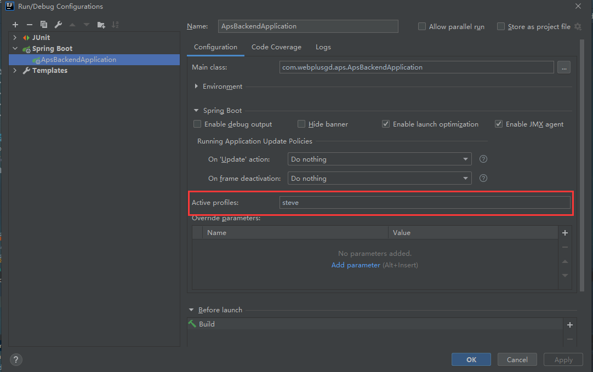

# APS

APS课程设计的后端部分，为*NJUSE*2017级互联网开发方向实践大作业。总体分为SOA+前端+后端三部分。前端使用Vue全家桶，后端使用Springboot框架。

### 启动

1. IDEA 或者 Eclipse安装lombok插件
2. 在`application.yml`中修改本地数据库配置，添加对应的`@Profile`即可
3. 在idea→edit configurations处修改profile

4. 启动项目

### 接口文档

自行更改`application.yml`文件中`server.port`（默认为8080）与`aps.docsPath`的值（默认为`/docs`）

访问SwaggerUI：[http://localhost:8080/docs](http://localhost:8080/swagger-ui/index.html?configUrl=/api-docs/swagger-config)

### 技术选型

#### 后端

- [Spring Boot 2.3.4](http://spring.io/projects/spring-boot/)
- LiquiBase 数据库迁移工具

### 待完成的工作

……